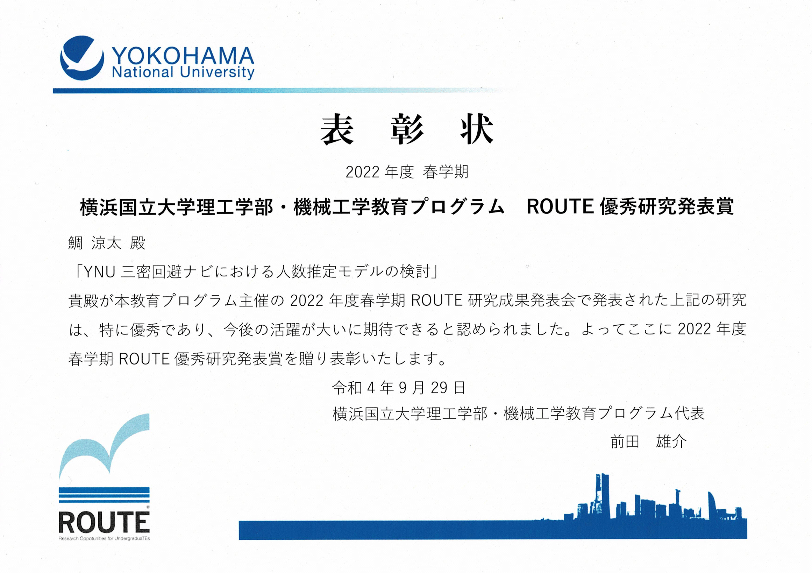

---
# Featured tags need to have either the `list` or `grid` layout (PRO only).
layout: page

# The title of the tag's page.
title: Awards

# The name of the tag, used in a post's front matter (e.g. tags: [<slug>]).
slug: awards

# (Optional) Write a short (~150 characters) description of this featured tag.
description: Awards

hide_description: true

# (Optional) You can disable grouping posts by date.
no_groups: true

# Exclude this example category from the sitemap.
# DON'T USE THIS SETTING IN YOUR CATEGORIES!
sitemap: false

permalink: /awards/
---

* this unordered seed list will be replaced by the toc 
{:toc .large-only}

## 2024
----------------------------------------------------------------
* Japan Society of Naval Architects and Ocean Engineers (JASNAOE), Reiwa 6th Year Annual Spring Conference Excellent Young Presenter Award

* Yokohama National University, Reiwa 5th Year Excellent Academic Performance Award

## 2023
----------------------------------------------------------------
* Yokohama National University, Reiwa 4th Year Autumn Semester Excellent Academic Performance Award

## 2022
----------------------------------------------------------------
* Yokohama National University, College of Engineering Science, Mechanical Engineering Program, [ROUTE(Research Opportunities for UndergraduaTEs)]{:.heading.flip-title} Excellent Research Presentation Award  
*"Examination of a model for estimating the number of people in YNU Three Cs Avoidance Navi"*

* Yokohama National University, Reiwa 4th Year Spring Semester Excellent Academic Performance Award

* Yokohama National University, Reiwa 3rd Year Autumn Semester Excellent Academic Performance Award

## 2021
----------------------------------------------------------------
* [The University of Tokyo, Chair for Global Consumer Intelligence (GCI) 2020 Winter Excellent Graduate]{:.heading.flip-title}

* Yokohama National University, Reiwa 3rd Year Spring Semester Excellent Academic Performance Award
  
## 2020
----------------------------------------------------------------
* Yokohama National University, Reiwa 2nd Year Spring Semester Excellent Academic Performance Award
  
## 2019
----------------------------------------------------------------
* [High School Chemistry Grand Prix]{:.heading.flip-title}, [Tokai Branch Encouragement Award]{:.heading.flip-title}

[ROUTE(Research Opportunities for UndergraduaTEs)]: http://es-route.ynu.ac.jp/
[The University of Tokyo, Chair for Global Consumer Intelligence (GCI) 2020 Winter excellent graduate]: https://gci.t.u-tokyo.ac.jp/gci2020winter-honors/
  
[High School Chemistry Grand Prix]: https://gp.csj.jp/ 
[Tokai Branch Encouragement Award]: https://tokai.chemistry.or.jp/wp-content/uploads/2022/09/award_2020.pdf
